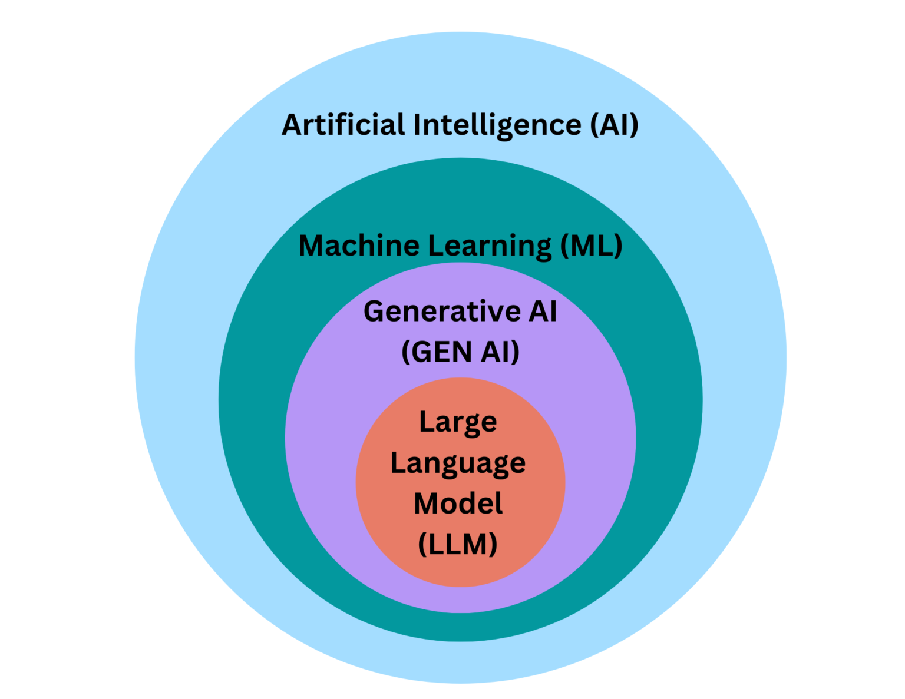

# Differentiate between AI, machine learning, deep learning, generative AI, and applied AI
- AI (Artificial Intelligence) is a broad term referred to a system which can perform tasks like humans.
- ML (Machine Learning) is a sub field of artificial intelligence in which a machine is trained to perform the tasks on the basis of trained data. In this training the quantity and quality of the data is a major challenge.
- Deep Learning is a sub filed of Machine Learning in which model or system is trained on the basis of neural networks and so called deep, these neural networks term is supposed same as neurons in human brain.
- Generative AI is a sub field of Artificial intelligence in which data like text, audio, images, video is generated on the same pattern as it was trained.
- A system which apply this artificial intelligence to solve real world problems is known as applied artificial intelligence.

