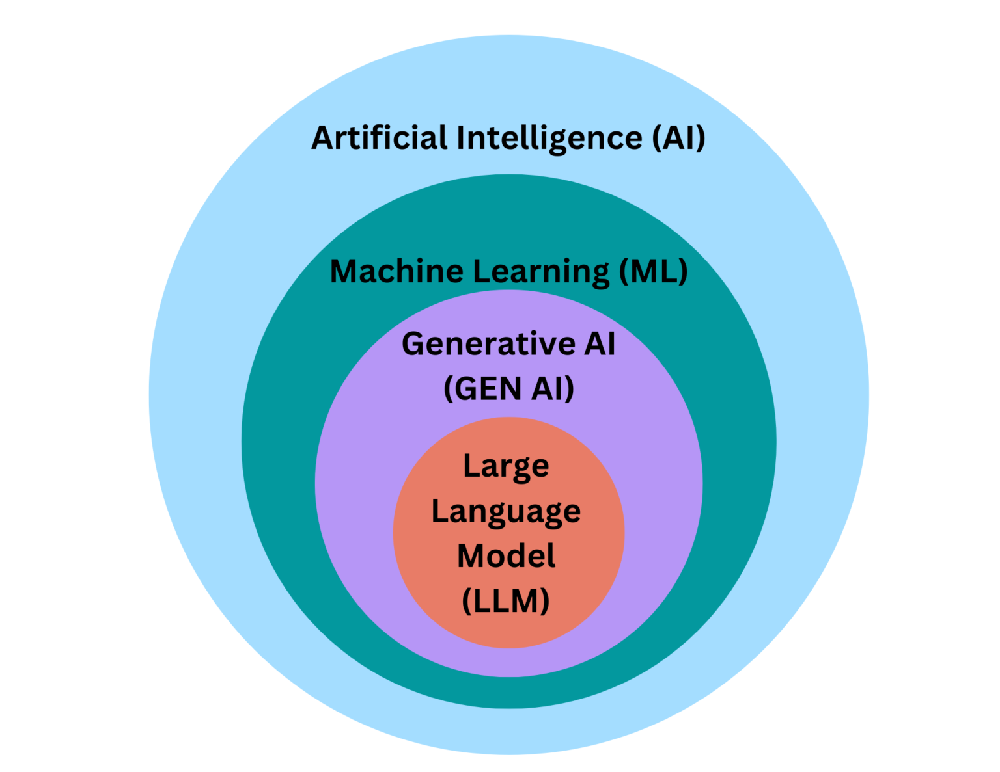

# Differentiate between AI, machine learning, deep learning, generative AI, and applied AI
- AI (Artificial Intelligence) is a broad term referred to a system which can perform tasks like humans.
- ML (Machine Learning) is a sub field of artificial intelligence in which a machine is trained to perform the tasks on the basis of trained data. In this training the quantity and quality of the data is a major challenge.
- Deep Learning is a sub filed of Machine Learning in which model or system is trained on the basis of neural networks and so called deep, these neural networks term is supposed same as neurons in human brain.
- Generative AI is a sub field of Artificial intelligence in which data like text, audio, images, video is generated on the same pattern as it was trained.
- A system which apply this artificial intelligence to solve real world problems is known as applied artificial intelligence.

# Define Artificial General Intelligence (AGI) and outline the five steps to achieve super-intelligence.
**Artificial General Intelligence** is a type of AI which possess the abilities to solve , understand and comprehend the problems as humans do i.e. on the basis of trained data it can understand the problem and make its solutions with same cognitive abilities as of humans.
Although AGI can resolve the problems as humans but at the current time it can not go beyond the human capabilities, however hope so this will be achieved in near future and this evolution will involve following stages:
1. Formation of chatbot
    This stage is achieved already in which chatbot like chatgpt. LLaMA3 etc have designed to respond the problems in generative form.
2. Reasoners
    In this stage reasoning of chatbot will be improved and currently industries are working on this.
3. Agents 
    AI agents will be designed which will respond to natural language and perform complex tasks with the help of other agents like planning a whole trip consists of room reservations, flight booking, taxi confirmation etc.
4. Innovators
    This stage will be more fascinating as in this stage models will have the abilities to think and innovate by themselves and they will have the abilities to make a model like them but with more extra abilities. 
5. Organizations
    in this stage a model will have the capabilities to run a large organizations on its own.